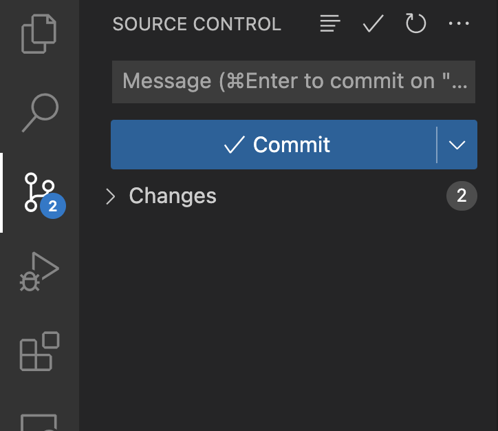

# vscode

## Keyboard shortcuts

### Everywhere

- `cmd + P`: go to file
- `cmd + shift + P`: show all commands
- `ctrl + \``: open terminal

### Navigation

- `cmd + B`: toggle sidebar
- `cmd + shift + E`: show Explorer sidebar
- `cmd + shift + F`: show Search sidebar
- `ctrl + shift + G`: show Source Control sidebar

### In code

- `cmd + shift + .`: show/navigate to symbols in file
- `alt + up/down`: move line up and down
- `alt + shift + up/down`: duplicate line
- `cmd + /`: comment/uncomment code
- multiple cursors
  - `alt + click`
